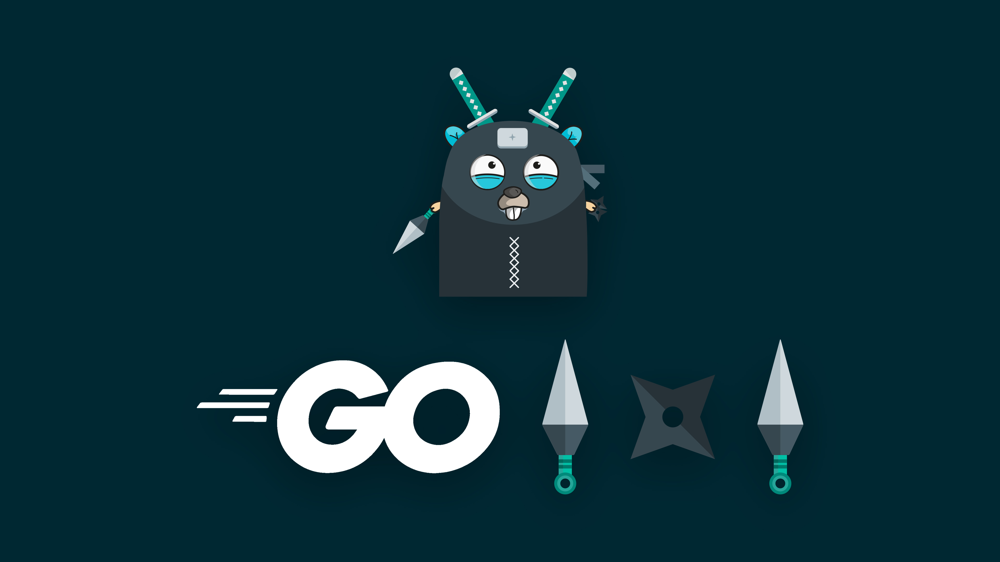

# Final summary



Here is some code:

hello.js
```js
console.log("Hello")
```

hello.go
```go
package main

import (
 "fmt"
)


func main() {
	fmt.Println("Hello")
}
```

The key message in this book:

Motivation can be derived from many different places, but the main force driving people to achieve is meaning. We attain a sense of meaning from activities that require us to put in a lot of effort, take ownership over a project and reach for significant goals.

Actionable advice:

**Use your lunch break to think about how to motivate yourself.**

Take 15 minutes over lunch to reflect on ways to heighten the sense of ownership and pride you take in your work. Specifically, think about the distinct contributions you make to your company that no one else could make. Understanding the value you bring to the company will certainly stoke your motivation and will in turn make you a better, happier worker.
